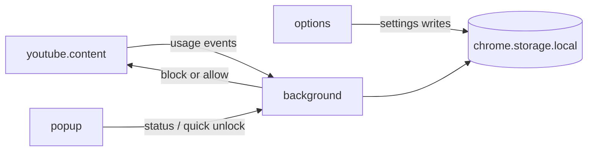

# YouTube limiter project structure

You will write the code. This plan is only the skeleton: where things live, what talks to what, and what WXT already gives you.

## Tooling

- **WXT + TypeScript + React**, Chrome MV3 only (`wxt.config.ts` with `manifest.manifest_version: 3` and Chrome as the sole browser).
- WXT generates `manifest.json`, HMR, and entrypoints from filenames under `src/entrypoints/`.
- **React from day one** for popup, options, and the YouTube block/unlock overlay. Domain logic (`limits`, `tracking`, `unlock`) stays plain TypeScript — no React imports there.
- Package manager: whatever you prefer (`pnpm` is the usual WXT default).

Create the app with:

```bash
pnpm dlx wxt@latest init
```

Choose TypeScript and React.

## Entrypoints vs domain modules

Keep Chrome “shell” code (when scripts run, how they talk) separate from product logic (limits, tracking, challenges). That is the main structural rule.



- **Background service worker** is the source of truth: evaluate limits, persist usage, issue unlocks, tell the tab to block. No React here.
- **YouTube content script** only observes the page (SPA navigations, video start, playback time) and mounts React UI (overlay, unlock challenges). It should not decide policy.
- **Popup** is a thin React status surface (today’s usage, active limits, “request unlock”).
- **Options** is the full React settings UI (rules, challenge count/difficulty, allowed windows).

## Recommended tree

```
youtube-limiter/
  wxt.config.ts
  package.json
  tsconfig.json
  public/                    # icons only
  src/
    entrypoints/
      background.ts          # alarms, messages, storage orchestration
      youtube.content.ts     # matches *://*.youtube.com/*; mounts overlay UI
      popup/
        index.html
        main.tsx
        App.tsx
        style.css
      options/
        index.html
        main.tsx
        App.tsx
        style.css
    shared/
      types.ts               # LimitRule, UsageState, UnlockSession, Settings
      messages.ts            # typed request/response unions
      storage.ts             # get/set schema + defaults
    domain/
      limits/
        types.ts             # session time, time-of-day, video count, ...
        evaluate.ts          # (settings, usage, now) => BlockDecision
      tracking/
        session.ts           # active watch session clock
        videos.ts            # video IDs / counts
        day.ts               # daily reset boundaries
      unlock/
        types.ts             # Challenge, UnlockGrant
        challenges.ts        # generators (math later; interface now)
        grants.ts            # timed unlock after success
      blocking/
        player.ts            # pause / hide player helpers (no React)
    components/              # shared React pieces used by popup, options, overlay
      UnlockChallenge.tsx
      StatusSummary.tsx
    overlay/                 # React UI injected into YouTube via shadow root
      OverlayApp.tsx
      overlay.css
```

WXT content-script naming: `youtube.content.ts` (or `youtube.content/index.ts`) so you can set `matches` in the file’s `defineContentScript({ matches: ['*://*.youtube.com/*'] })`.

Mount the overlay with WXT’s `createShadowRootUi` so YouTube’s CSS does not collide with React styles. The content script file stays the observer + mount point; `overlay/OverlayApp.tsx` is the actual UI.

## Data model (keep in `shared/types.ts`)

Start with one settings blob and one usage blob. New limit types add fields without changing entrypoints.

- **Settings**: enabled flags, session cap, daily windows (e.g. no YouTube after 22:00), video count cap, unlock policy (`challengeCount`, later difficulty).
- **Usage**: current session started-at / accumulated watch ms, videos watched today, last reset date, active unlock grant (`until` timestamp).
- **BlockDecision**: `{ allowed: boolean, reason, remaining? }` from `domain/limits/evaluate.ts`.

Use `chrome.storage.local` (not `sync`) for usage counters; settings can stay in `local` until you care about multi-device.

## Messaging (`shared/messages.ts`)

Define a closed union so popup, content script, and background stay typed:

- `USAGE_TICK` / `VIDEO_STARTED` from content → background
- `GET_STATUS` from popup → background
- `REQUEST_UNLOCK` / `UNLOCK_ANSWER` for the challenge flow
- `BLOCK_STATE` from background → content (apply or remove overlay)

Background should re-evaluate on: usage events, `chrome.alarms` (minute ticks + scheduled windows), storage changes from the options page.

## YouTube specifics (content script only)

YouTube is an SPA. Put navigation detection in the content script (`yt-navigate-finish` and/or URL observer), not in the background. Count a “video” when a watch URL actually starts playback, not on every homepage click. Shorts are still `youtube.com`; treat them as videos unless you later split rules.

Blocking should be a React overlay (shadow root) + pause, not `webRequest` blocking. MV3 cannot reliably cancel YouTube media that way, and an overlay is what you need for the unlock UI.

## Unlock (structure now, math later)

In `domain/unlock/`, define:

- `Challenge` interface (`id`, `prompt`, `check(answer)`)
- `ChallengeGenerator` so quadratic equations (or anything else) plug in later
- `UnlockGrant` (`expiresAt`, maybe `scope: 'session' | 'global'`)

`components/UnlockChallenge.tsx` renders prompts and collects answers; it must not grant unlocks itself. Options controls **how many** challenges and later difficulty. The popup or overlay only runs the generator and sends answers to the background; the background is what writes the grant so it cannot be bypassed by editing the page.

## What not to add yet

- Firefox / Safari targets
- `webRequest` / DNR rules for YouTube
- Persisting challenge answers or a backend
- Tests until the domain functions (`evaluate`, `grants`) exist
- Extra UI libraries (router, component kits) until options actually need them

## First files to create after `wxt init`

1. `src/shared/types.ts` + `storage.ts` + `messages.ts`
2. `src/domain/limits/evaluate.ts` with one dummy rule (always allow) so the loop is wired
3. Background + YouTube content script + empty React popup/options (`App.tsx`)
4. Then grow limits, unlock, and overlay behind those interfaces
